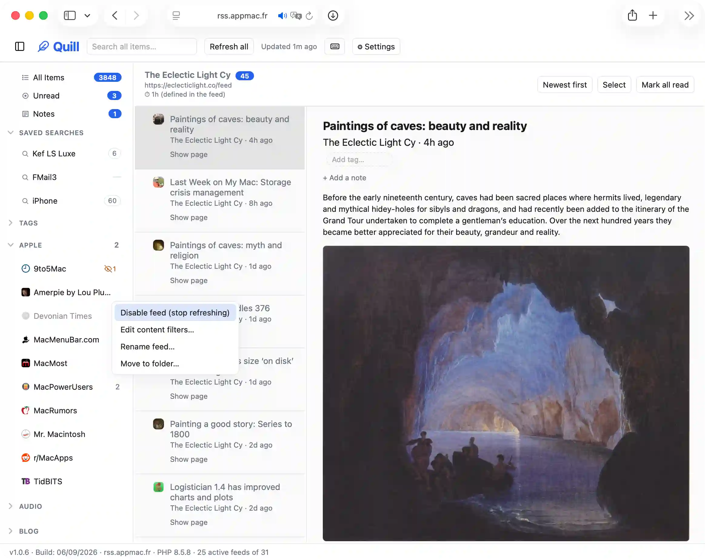

# Quill

A minimal, self-hosted RSS/Atom/JSON feed reader for one person. Plain PHP (no framework), flat JSON file storage (no database), vanilla HTML/CSS/JS (no build step).



## Features

- Add feeds by URL, or paste a site URL and pick from its discovered feeds
- Folders (collapsible sidebar tree), Unread and Saved views, saved searches with live match counts
- Read/unread and starred tracking, personal notes and tags on items (tag autocomplete, browsable sidebar tag list), per-feed content filters, per-feed enable/disable
- Manual refresh or scheduled refresh (cron/launchd/URL-based), with per-feed refresh intervals (auto-detected from feeds that declare their own, editable otherwise)
- Favicons and item thumbnails resolved automatically, no third-party services
- OPML import/export and full backup/restore (zip/gzip/JSON)
- Single-user login (bcrypt password, PHP session) — no database, no third-party auth

See the in-app Settings panel and feed row menus for the full interaction surface, or [DOCUMENTATION.md](DOCUMENTATION.md) for the complete reference.

## Setup (local, macOS)

```
brew install php
cp src/config.sample.php src/config.php   # if not already done
php -S localhost:8000 -t public
```

Open http://localhost:8000/ and create your login on first visit. Data lives under `data/` as JSON files. Lost your password? Delete `data/auth.json` to reset login only — feeds/items are untouched.

## Scheduled refresh

`cron/refresh.php` refreshes every feed past its interval and logs to `data/cron.log`. Pick one:

- **No shell access**: enable `public/cron.php` with a `CRON_TOKEN` in `src/config.php`, then hit its URL on a schedule (host cron panel, cron-job.org, GitHub Actions).
- **Shell/cron**: `*/15 * * * * php /path/to/rss/cron/refresh.php >> /path/to/rss/data/cron-stderr.log 2>&1`
- **launchd (macOS)**: a `LaunchAgent` plist calling the same script on an interval.

The manual "Refresh all" button always force-refreshes regardless of interval.

## Deploying

1. Run `bin/package-for-deploy.sh` — builds `./deploy/` from `git archive` (no local data, ever), stamps the version, and scaffolds `src/config.php`. Upload its contents; point the doc root at `public/` if possible.
2. No custom doc root? `.htaccess` in `data/`/`src/` blocks direct access as a fallback.
3. Optional: HTTP Basic Auth via `public/.htaccess` as defense-in-depth on top of app login.
4. Set up scheduled refresh (above) — Option A (URL cron) works on any host.

## Updating

Pull/download the new version, re-run `bin/package-for-deploy.sh`, and upload it over the old install. On your server you can replace `public/`, `cron/`, `bin/`, and all of `src/` **except** `src/config.php` — that one file holds your login credentials and `CRON_TOKEN`, and overwriting it with the freshly generated one wipes them. Leave `data/` alone entirely. The footer shows the deployed version and flags when a newer tag exists.

## Project layout

```
public/          document root: index.html, style.css, app.js, api/*.php, cron.php
src/             PHP classes: Storage, Auth, FeedFetcher, FaviconResolver, FeedDiscovery, RefreshService, OpmlImporter, YouTubeResolver
data/            feeds.json, auth.json, items/<feed_id>.json, cron.log
cron/refresh.php CLI scheduled-refresh entry point (see also public/cron.php)
```

Every `public/api/*.php` endpoint requires login except `auth.php`; `public/cron.php` is unauthenticated but gated by `CRON_TOKEN`. See inline docblocks / `src/` for endpoint details.
